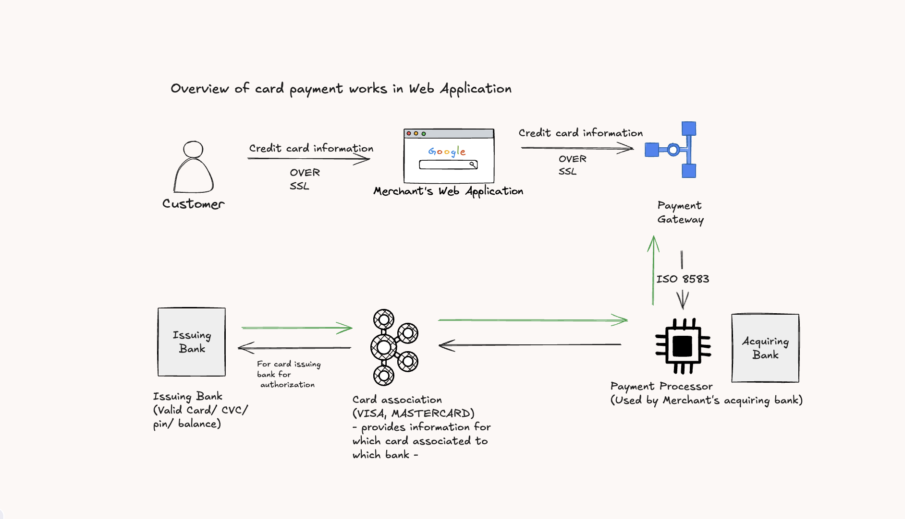

## 💳 Overview of Card Payment Flow in a Web Application

This diagram illustrates how online card payments are processed step-by-step:

1. **Customer enters card details**
   - The customer inputs their card information (card number, expiry, CVC) on the merchant's secure checkout page.
   - The data is transmitted securely via **SSL/TLS**.

2. **Merchant forwards payment details**
   - The merchant securely forwards the card data to a **Payment Gateway** over SSL.

3. **Payment Gateway processes request**
   - Validates and encrypts the payment information.
   - Converts it into a standard message format (e.g., **ISO 8583**).
   - Forwards the request to the **Payment Processor**.

4. **Payment Processor (via Acquiring Bank) routes request**
   - Works with the **Acquiring Bank** to send the transaction to the **Card Association** (e.g., Visa, Mastercard).

5. **Card Association identifies issuing bank**
   - Determines which **Issuing Bank** is responsible based on the card number.
   - Routes the request accordingly.

6. **Issuing Bank verifies and authorizes**
   - Checks the card’s validity, CVC, expiration date, available balance, and applies fraud checks.
   - Sends back an authorization response (approved or declined).

7. **Response travels back to the merchant**
   - The response follows the same route in reverse:
     - **Issuing Bank** → **Card Association** → **Payment Processor** → **Payment Gateway** → **Merchant**
   - The merchant displays the payment result to the customer.

# Accept a Payment with Stripe Checkout

Stripe Checkout is the fastest way to get started with payments. Included are some basic build and run scripts you can use to start up the application.

## Set Price ID

In the back end code, replace `{{PRICE_ID}}` with a Price ID (`price_xxx`) that you created.

## Running the sample

1. Build the server

~~~
npm install
~~~

2. Run the server

~~~
npm start
~~~

3. Go to [http://localhost:4242/checkout.html](http://localhost:4242/checkout.html)
